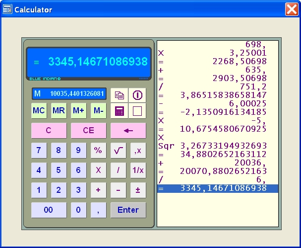



## Calculator control

### Description

Some bugs are fixed

This is a simple but compleet working calculator control with settings for colors etc.

It returns the value in the Closing event and you can also copy the calculation value to the clipboard.
 
### More Info
 

             |
---                |---
**Submitted On**   |2008-08-30 01:00:00
**By**             |[Ben Vonk](https://github.com/Planet-Source-Code/PSCIndex/blob/master/ByAuthor/ben-vonk.md)
**Level**          |Intermediate
**User Rating**    |4.8 (19 globes from 4 users)
**Compatibility**  |VB 6\.0
**Category**       |[Custom Controls/ Forms/  Menus](https://github.com/Planet-Source-Code/PSCIndex/blob/master/ByCategory/custom-controls-forms-menus__1-4.md)
**World**          |[Visual Basic](https://github.com/Planet-Source-Code/PSCIndex/blob/master/ByWorld/visual-basic.md)
**Archive File**   |[Calculator213966162009\.zip](https://github.com/Planet-Source-Code/ben-vonk-calculator-control__1-71019/archive/master.zip)

